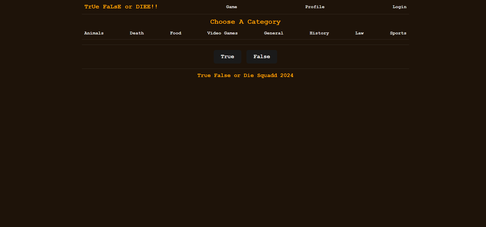

## Truth-False-Or-Die

## Description

True False or Die is a boolean question game. It allows users to choose between numerous different categories of true or false questions. They are presented with a timer and players attempt to answer as many questions as possible before the time runs out. After, they are given a score that reflects the quantity of correct answers. Users can login and save their info.

## Table of Contents (Optional)

- [Installation](#installation)
- [Usage](#usage)
- [Credits](#credits)
- [License](#license)

## Installation

Git clone the repo onto your computer. Then, run an npm install. Next, do npm run seeds. Finally, do npm run develop to start the server.

## Usage

On the Game screen a user can choose the category that they want to play when the first question loads the timer will start counting down the user is encouraged to finish ten of the questions before the time runs out. 

https://truth-false-or-die.onrender.com/

## Credits

Maxwell Kaufman (github.com/)
Mason McNeil (github.com/masonamc5)
Henry Thomas (github.com/)
Darbie Rousseau (github.com/)

## License

MIT

